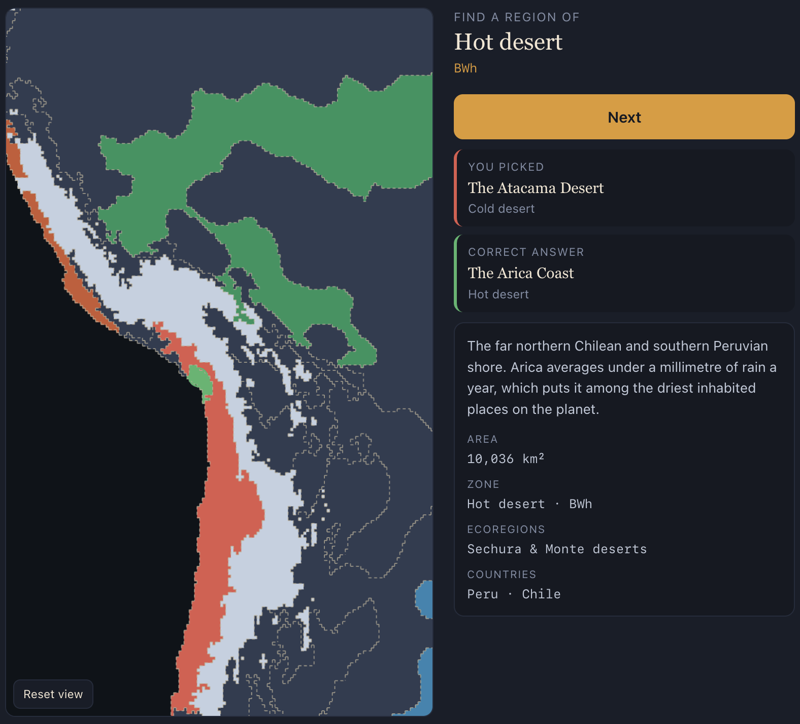
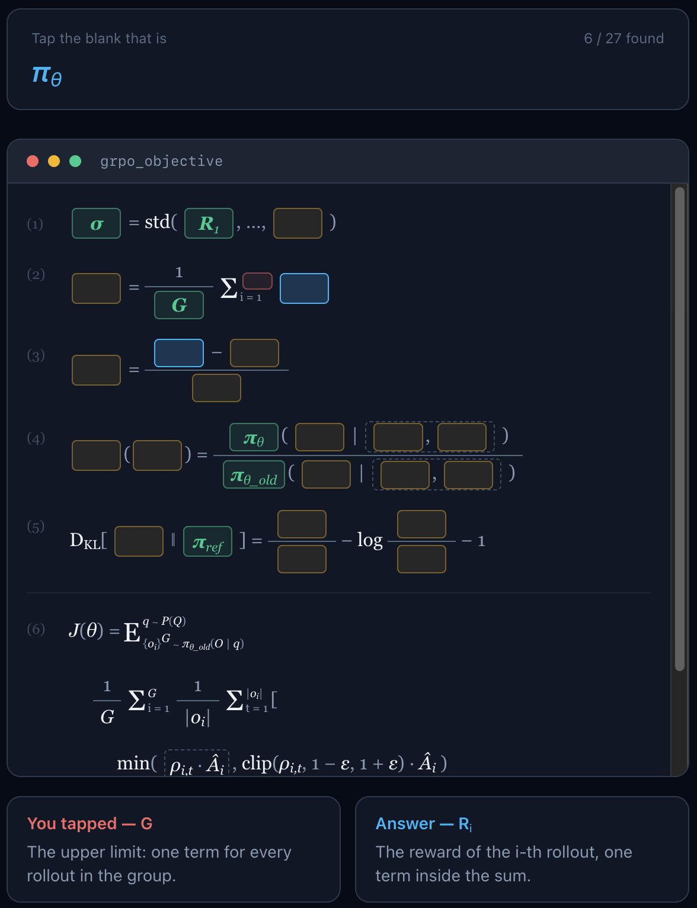
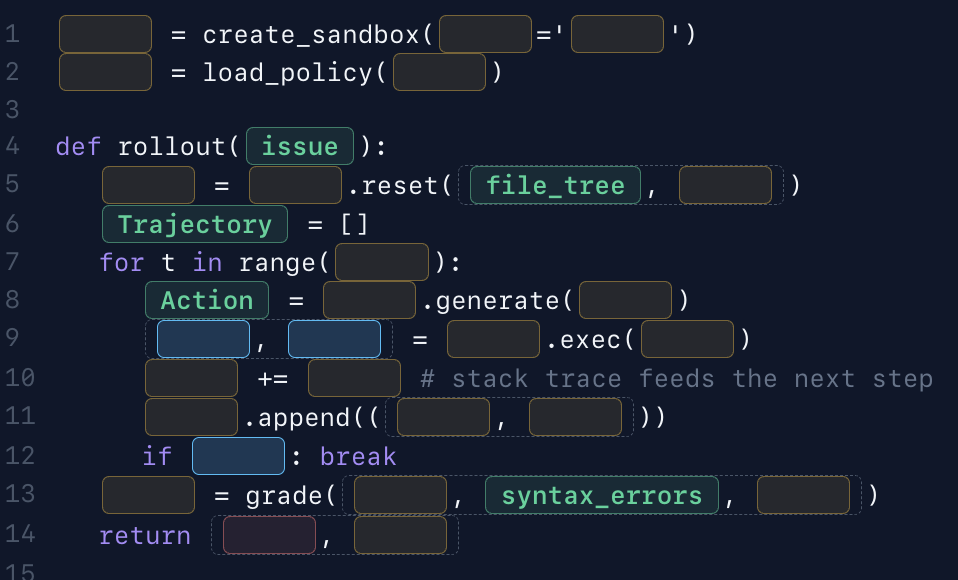

# Information Maps

Memorize anything.

Adventures in self-quizzing to learn fast. Interactions are simple: prompt, tap, repeat. 
Idempotent mode makes correct answers sticky; keep guessing until you get 'em all.

Subjects include Earth Sciences, Geography, Machine Learning, and Music.

In geography, a correct answer is clear by its position:



The same principle can be applied to math,



And through code it can be applied to processes too:




## Run it

```sh
./start.sh          # installs deps on first run, then starts the dev server
```

or directly:

```sh
npm install
npm run dev         # http://localhost:5173
npm run build       # production build into dist/
npm run preview     # serve the production build
npm run typecheck   # tsc --noEmit (see note below)
```

## Layout

```
src/
  app/        shell — routing, catalog, layout, progress store (localStorage)
  ui/         shared primitives (SegButton, Toggle, Panel, headings)
  engine/     headless quiz session hook + answer matching
  map/        projection helpers + a generic pan/zoom SVG map surface
  content/
    registry.ts            the catalog manifest — one entry per drill
    <subject>/<id>/index.*  each drill, data co-located, lazily loaded
public/
  explorables/  the two legacy full-page HTML explorables (served in an iframe)
```

Every drill is a route-level lazy chunk, so opening the catalog loads none of
the (sometimes hundreds of KB) embedded map geometry until a drill is picked.
